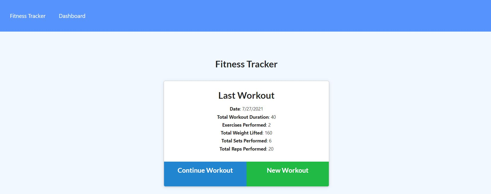
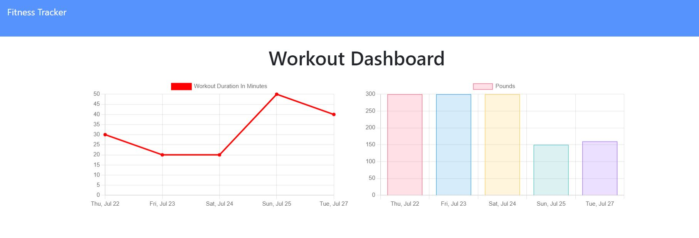
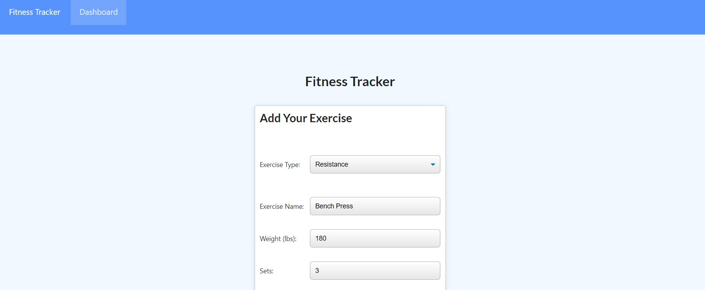

# 🏋️‍♂️ Fitness Tracker




## 📝Description

```
Fitness Tracker is a workout planning and tracking application
that's built with Javascript, Express Js and MongoDb. The app 
gives you the ability to create resistance and cardio based 
workouts. The most recent workout displays when you visit 
the app, from there you can continue to add additional exercises 
to that workout or create a new one. On the dashboard page, you 
are shown the last 7 days of total workout time along with the
total weight for each day in that period.  
```

## 🧰 Technologies Used

* `Node.js`
* `npm (Node Package Manager)`
* `Javascript`
* `MongoDb Atlas`
* `Mongoose`
* `Express JS`


## 🤸‍♂️Challenges/Successes

1. MongoDb and Mongoose casting of dates for the workouts in a range of dates.
    * Used Javascript new Date() method to get milliseconds, then passed the milliseconds into a second Javascript new Date() method which processed correctly in the mongoose query.  

2.  Summarizing MongoDb data using mongoose. 
    * Tested various ways of grouping and summarizing in the mongo shell successfully. Tried the same solutions with mongoose without success. Studied the mongoose documentation and ended up using the Aggregrate, Project, and AddFields stages to summarize by a date range. 


## 📸 Screenshots

> Workout Dashboard showing a summary of workout duration and total pounds in the workouts over the past 7 days. 



> Fitness Tracker form to add exercises to the existing workout plan or to create a new plan for the current day.



## 🔗 Application Links

* [Github](https://github.com/malmason/workout-tracker)
* [Heroku Deployment](https://murmuring-lake-01156.herokuapp.com/)

## 📱 Contact 

Malcolm Mason - [Github](https://github.com/malmason) Email: [Malcolm](mailto:malmason66@gmail.com) 📧

---

&copy; 2021 Malcolm Mason